0.脚本执行策略

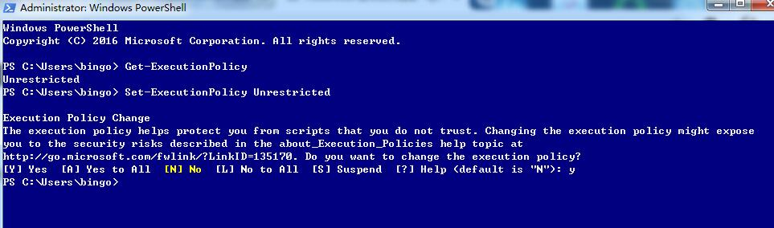

1.查询带service 的命令
```powershell
Get-Command -Noun service
```


2.查看powershell所有的命令
```powershell
Get-Command
```
3.获取当前系统的所有服务(包含启动和停止)
```powershell
Get-Service
```
4.查看某个命令的帮助信息
```powershell
Get-Help Get-Service
```
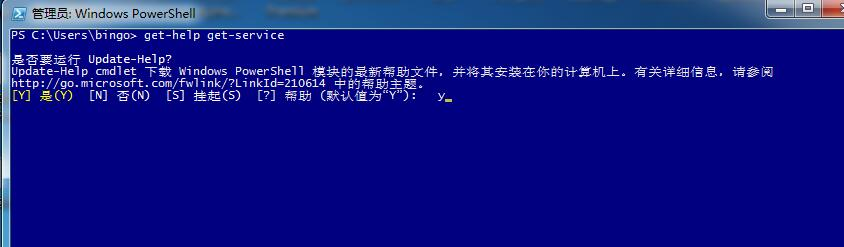

5.查看某个命令的使用示例
```powershell
Get-Help Get-Service -examples
```
6.在线查看某个命令的帮助信息
```powershell
Get-Help Get-Service -online
```
7.查看某个别名的实际命令
```powershell
Get-Alias cls
```
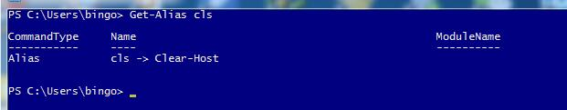

8.查看系统进程
```powershell
Get-Process
```
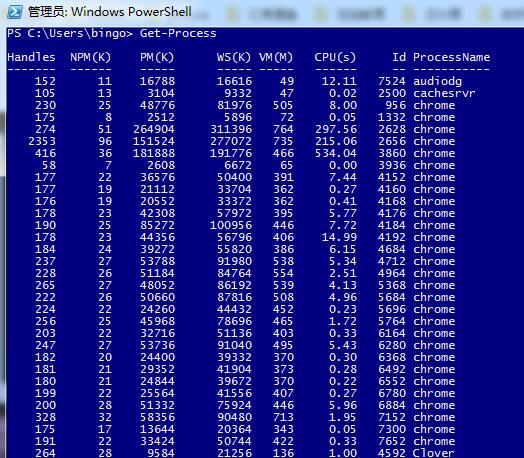

查看指定名字的进程
```powershell
Get-Process -Name chrome
```
查看进程所有属性
```powershell
Get-Process -Name chrome | Get-Member
```
查看进程所有的对象
```powershell
Get-Process -Name QQ | Select-Object *
```
9.变量操作

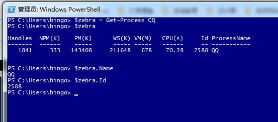

10.查看历史操作记录
```powershell
Get-History

history
```
11.查询系统硬盘列表
```powershell
get-psdrive
```
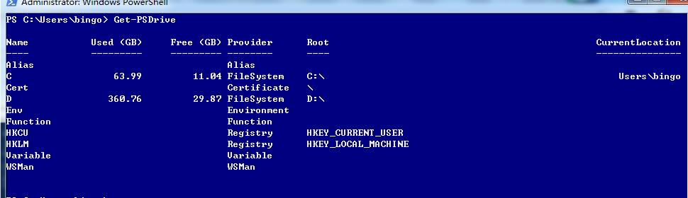
```powershell
Get-PSDrive | Where-Object {$_.Free -gt 1}
```
 $_ 代表当前管道传过来的所有对象

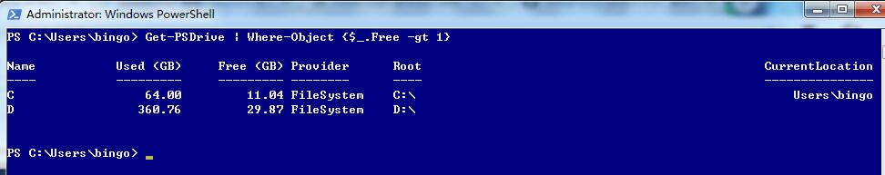
```powershell
Get-PSDrive | Where-Object {$_.Free -gt 1} | Select-Object Root,Used,Free
```
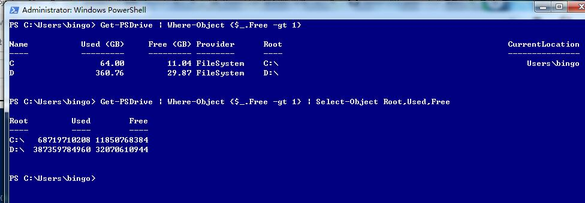

```powershell
Get-PSDrive | Where-Object {$_.Free -gt 1} | ForEach-Object {Write-Host "Free Space for" $_.root "is"  $_.Free -ForegroundColor green}
```

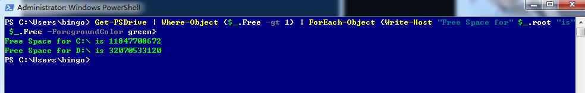

对空闲的硬盘空间进行单位换算和小数点位数保留

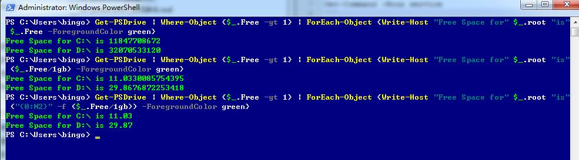

```powershell
Get-PSDrive | Where-Object {$_.Free -gt 1} | ForEach-Object {$count = 0; Write-Host "";}  {$_.Name +
": Used:" + "{0:N2}" -f ($_.Used/1gb) + "Free" + "{0:N2}" -f ($_.Free/1gb) + "Total" + "{0:N2}" -f (($_.Used/1gb)+($_.Fr
ee/1gb)); $count = $count + $_.Free; } {Write-Host "";Write-Host "Total Free Space" ("{0:N2}" -f ($count/1gb)) -Backgrou
ndColor Magenta}
```
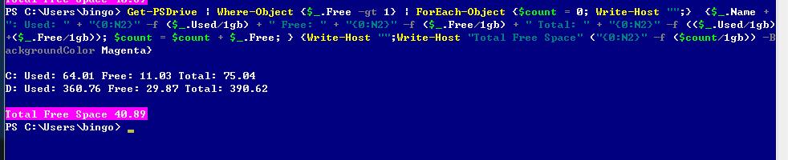


12.


