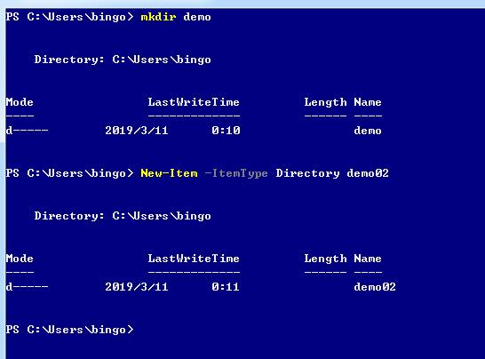
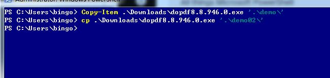

1.查看当前目录和查看目录的文件
```powershell
Get-ChildItem .\AppData\

Get-Item .\AppData\
```
 


2.创建新的目录
```powershell
mkdir demo

New-Item -ItemType Directory demo02
```



3.拷贝文件到某个目录
```powershell
Copy-Item .\Downloads\dopdf8.8.946.0.exe '.\demo\'

cp .\Downloads\dopdf8.8.946.0.exe '.\demo02\'

```


拷贝当前目录下所有的文件

Copy-Item * ..\..\demo\

拷贝当前目录下的文件和文件夹里面的子目录，强制覆盖

Copy-Item * ..\..\demo\ -Recurse -Force

4.移动和删除某个文件 

```powershell
Move-Item .\control.ps1 ..\..\demo02\

Remove-Item .\control.ps1
```


 
