### 1. 官网下载

http://mirrors.jenkins.io/

http://mirrors.jenkins.io/windows-stable/

### 2.  默认配置

默认端口 8080

默认安装路径 C:\Program Files (x86)\Jenkins

默认服务 Jenkins 配置为开机自动启动

### 3.  安装插件

PowerShell

### 4.  修改Jenkins 服务为管理员账户启动 

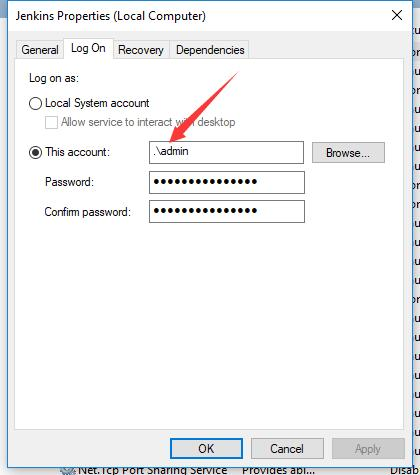

### 5.  配置账号密码通过加密文本来绑定

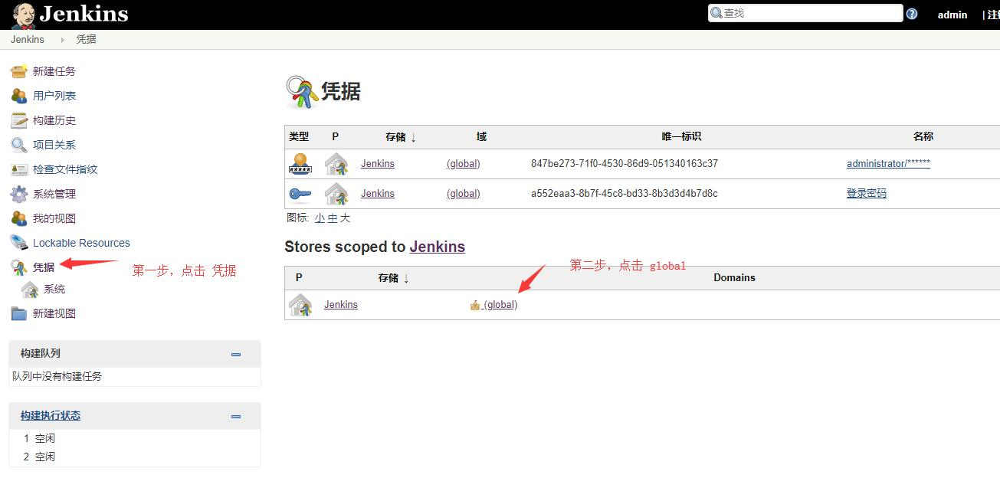

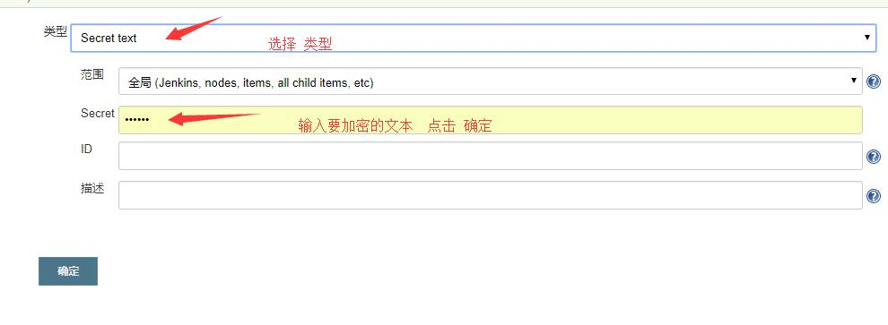

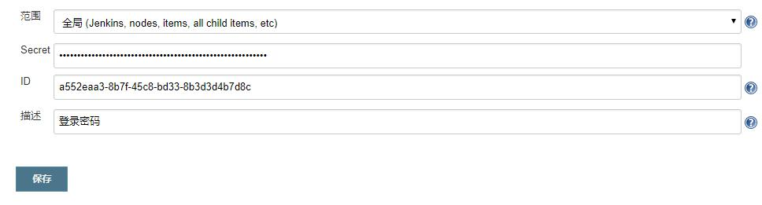

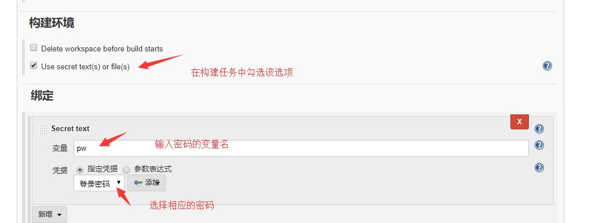

在构建任务中进行调用

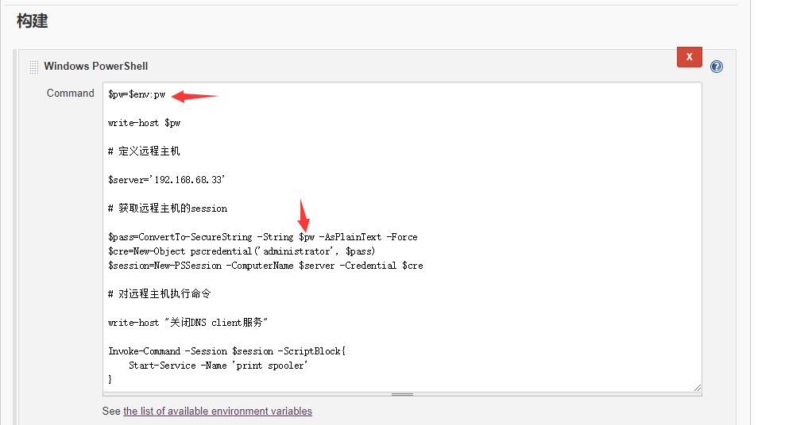

### 6.  根据SVN tag 参数构建

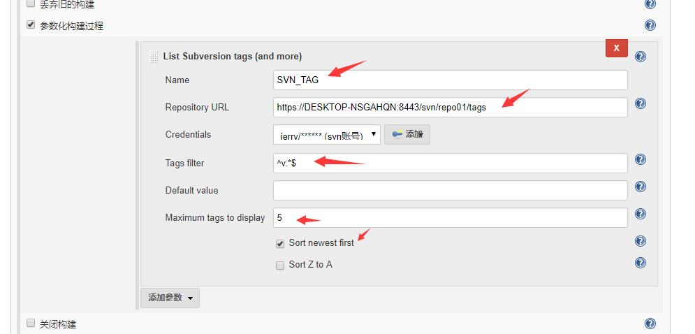

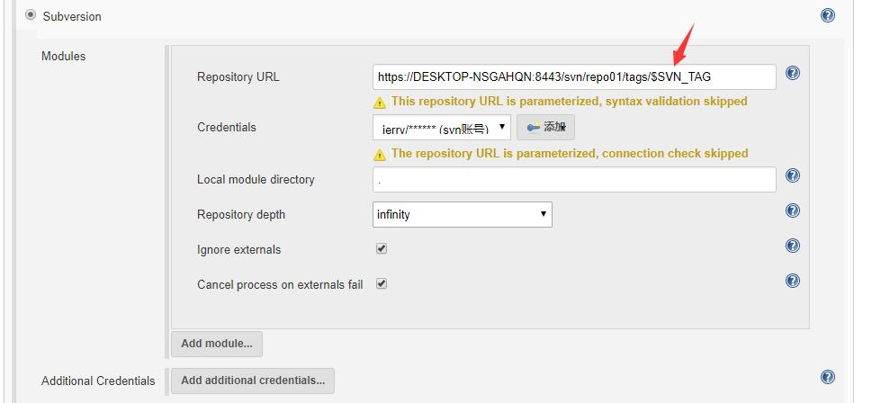

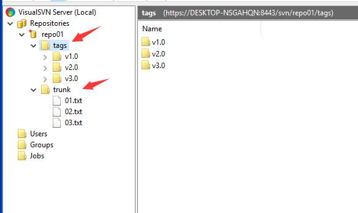

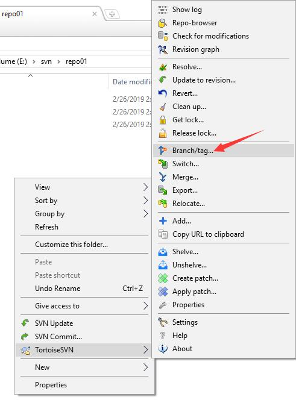

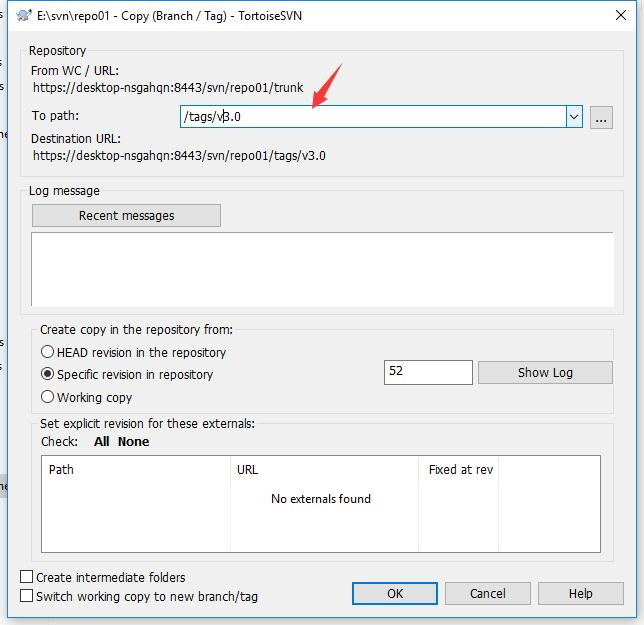

