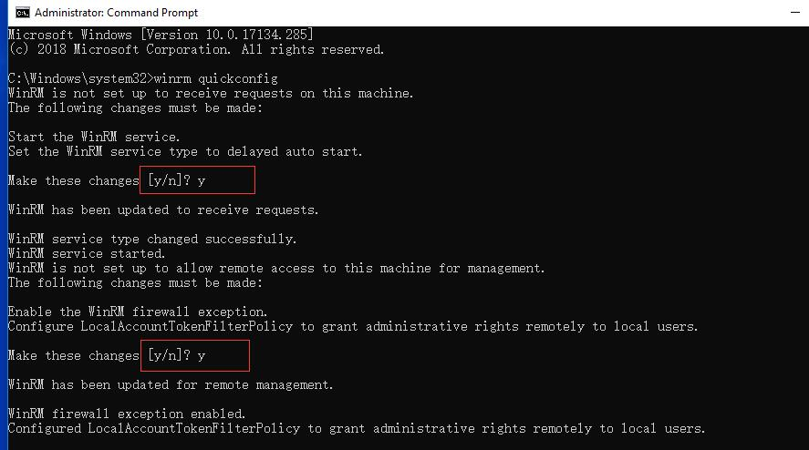
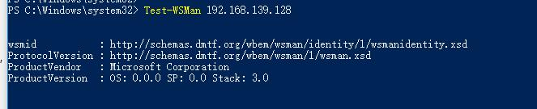

# 0. 官网

powershell 官网

https://docs.microsoft.com/en-us/powershell/wmf/overview

https://docs.microsoft.com/en-us/powershell/

powershell ISE 编辑器下载

https://www.microsoft.com/en-us/download/details.aspx?id=45885

开源项目

https://github.com/PowerShell/PowerShell

powershell 在线学习网站

http://www.pstips.net/

http://www.splaybow.com/powershell.html


# 0.1 启用 接受远程请求(开启远程访问)
```
winrm quickconfig
```


# 0.2 在 客户端  设置白名单
```
winrm set winrm/config/client '@{TrustedHosts="*"}'
```

# 0.3 测试远程主机是否允许连接

```
Test-WsMan xxx.xxx.xxx.xxx
```




# 1. 查看PowerShell版本信息

```powershell
$PSVersionTable.PSVersion
```

# 2. 查看某个命令对帮助信息和使用例子

```powershell
get-help Copy-Item -examples
```

# 3. 更新本地的帮助信息文档

```powershell
Update-Help -Verbose -Force -ErrorAction SilentlyContinue
```

